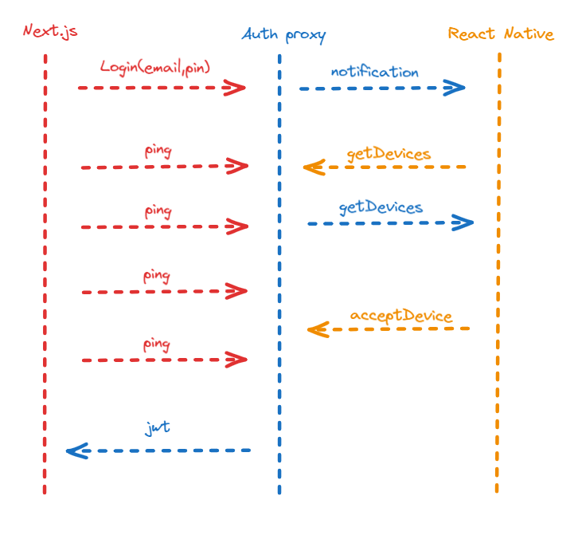

# Auth Proxy

## Logic for login

## Implement

- Rate Limiting and IP Blocking: Implementing rate limiting and IP blocking helps protect against brute-force attacks and other forms of abuse by limiting the number of login attempts from a single IP address within a certain time period.

When user login, it will get jwt that will expire in 1 hour. The jwt have userId and securityStamp.
